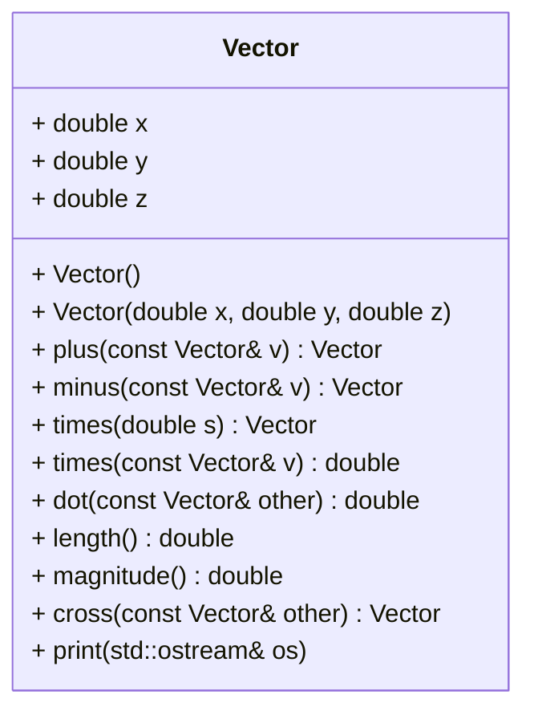

# Representation of Vectors in Three Dimensional Euclidean Space

After finishing the below tasks, run the following commands to see if your code
is correct. Note that your code has to compile successfully in order for the
tests to be used.

```shell
mkdir build && cd build
cmake ..
make -j4
make test
```

As an alternative to `make test` (or `ctest`) you can run the individual
`test_*` executables.


## Instructions

Write library code for representing three dimensional vectors (not to be
confused with a C++ `std::vector`). In engineering,
a Euclidean vector or simply a vector is a geometric object that has magnitude 
(or length) and direction.

Such vectors have support many basic operations including 
addition, subtraction and scalar multiplication. There are also 
additional binary operations like the dot product and the cross product.

It is your duty to implement a data structure for storing and modifying
vectors and the most common operations on such vectors.

The public interface of the class must support API laid out in the UML class 
diagram below. You have to correctly declare the member functions' `const`-ness 
in order to allow the provided auto-tests to compile. Place all your
declarations and definitions inside the appropriate namespace
(the namespace name must match the namespace used in the provided test cases).

You may store any additional internal properties or add additional private 
or public member functions. Some of the required operators may be defined
as class members while others cannot be a member. It is up to you to pick
the correct approach and decide upon the valid alternatives when appropriate.





## Definition of a Vector's Lengh (Magnitude)
The `length` or `magnitude` $‖a‖$ of the vector $a$  can be computed with the 
euclidean norm

$$
\left\|\mathbf{a}\right\|=\sqrt{a_1^2+a_2^2+a_3^2}
$$

## Coordinate Definition of the Dot Product
The dot product of two vectors
$\mathbf{a} = [a_1, a_2, a_3]$ and $\mathbf{b} = [b_1, b_2, b_3]$ 
is defined as

$$
\mathbf a \cdot \mathbf b = \sum_{i=1}^3 a_i b_i = a_1 b_1 + a_2 b_2 + a_3 b_3
$$


## Definition of Two Vector's Cross Product

Using column vectors, the dot product can be represented as follows

$$
\begin{bmatrix}s_1\\s_2\\s_3\end{bmatrix}=
\begin{bmatrix}a_2b_3-a_3b_2\\a_3b_1-a_1b_3\\a_1b_2-a_2b_1\end{bmatrix}
$$


# Grading
This task will primarily be graded using autotests. You also need
to maintain a consistent coding style. In particular, all identifiers and
comments have to be in English!
